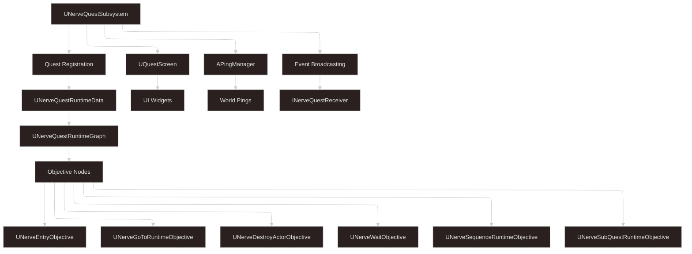

# LazyNerveQuest Plugin

A comprehensive quest management and progression system for Unreal Engine featuring visual graph-based quest design, modular objective framework, dynamic UI integration, and extensive Blueprint/C++ support.


> 📖 **Complete Documentation Available:** For detailed API reference, advanced tutorials, and comprehensive guides, visit the **[official documentation site](https://lazyblog.jobomondiale.com/plugin-docs/nerve-quest/getting-started/installation)**.

## 🚀 Features

### Core Quest System
- **Visual Graph-Based Quest Design** - Node-based editor for creating complex quest flows
- **Modular Objective Framework** - Extensible system supporting custom objective types
- **Dynamic UI Integration** - Complete quest screen and widget system
- **Full Blueprint & C++ Support** - Complete API access for both development approaches

### Quest Management
- **Complex Branching Quests** - Support for non-linear quest structures with multiple paths
- **Sub-Quest System** - Nested quest support with independent progression and tracking
- **Optional Objectives** - Additional objectives that don't block main quest progression
- **Time Limits** - Quest and objective-level time constraints with automatic failure handling
- **Area Restrictions** - Location-based quest activation and completion requirements
- **Custom Rewards** - Flexible reward system integration with game-specific implementations

### Built-in Objective Types
- **UNerveEntryObjective** - Quest starting points and flow control
- **UNerveGoToRuntimeObjective** - Location-based navigation objectives with world pings
- **UNerveDestroyActorObjective** - Target elimination with progress tracking
- **UNerveWaitObjective** - Time-based objectives with event triggers
- **UNerveSequenceRuntimeObjective** - Multi-step objective chains
- **UNerveSubQuestRuntimeObjective** - Embedded sub-quest management

### UI & Navigation System
- **World-Space Navigation Pings** - 3D waypoint system with customizable ping actors
- **Quest Screen Framework** - Complete UI system with multiple screen types:
  - `UWBP_QuestScreen` - Main quest tracking display
  - `UWBP_QuestCodexScreen` - Quest journal/codex interface  
  - `UWBP_QuestCategoryMainpanel` - Category-based quest organization
- **Progress Tracking** - Real-time objective and quest progress updates
- **Quest Objective Containers** - Modular UI components for objective display

### Event System
- **Comprehensive Event Broadcasting** - Quest completion, failure, and progress events
- **INerveQuestReceiver Interface** - Event receiver system for game integration
- **Gameplay Tag Support** - Tag-based event system for flexible quest triggers
- **World Context Management** - Proper world context handling for multiplayer scenarios

## 📋 Requirements

- **Unreal Engine:** 5.0 or later
- **Target Platforms:** All platforms supported by Unreal Engine
- **Dependencies:** None (self-contained plugin)

## 🛠 Installation

### Method 1: Project Plugin Directory
1. Download/clone the plugin repository
2. Copy the `LazyNerveQuest` folder to your project's `Plugins` directory
3. Create the `Plugins` directory in your project root if it doesn't exist
4. Regenerate project files (right-click `.uproject` → Generate Visual Studio project files)
5. Compile the project

### Method 2: Engine Plugin Directory
1. Copy the `LazyNerveQuest` folder to your Unreal Engine's `Engine/Plugins` directory
2. The plugin will be available to all projects using that engine installation

### Enabling the Plugin
1. Open your project in Unreal Editor
2. Navigate to **Edit** → **Plugins**
3. Search for "LazyNerveQuest" in the LazyGenerics category
4. Check the **Enabled** checkbox
5. Restart the editor when prompted

## ⚡ Quick Start

### 1. Initialize Quest System

```cpp
// C++ - Get quest subsystem reference (typically in GameMode or PlayerController)
UNerveQuestSubsystem* QuestSubsystem = GetLocalPlayer()->GetSubsystem<UNerveQuestSubsystem>();

// Setup quest UI screen (call once during game initialization)
QuestSubsystem->SetupQuestScreen();
```

### 2. Create Your First Quest

1. **Create Quest Asset**
   - Right-click in Content Browser → **Nerve Quest** → **Nerve Quest Asset**
   - Name your quest (e.g., "TutorialQuest")

2. **Design Quest Graph**
   - Double-click the quest asset to open the graph editor
   - Drag objective nodes from the palette
   - Connect objectives using output pins to create quest flow
   - Set entry point for quest start

3. **Configure Objective Properties**
   - Select objective nodes to edit properties in Details panel
   - Set display text, completion requirements, time limits, etc.
   - Configure objective-specific settings (locations, targets, etc.)

### 3. Register and Start Quests

```cpp
// C++ - Add quest to player's active quests
bool bSuccess = QuestSubsystem->AddQuest(QuestAsset, true, this);
if (bSuccess) 
{
    UE_LOG(LogTemp, Log, TEXT("Quest '%s' started successfully"), *QuestAsset->GetName());
}

// Track quest in UI
QuestSubsystem->TrackQuest(QuestAsset);
```

### 4. Handle Quest Events

```cpp
// C++ - Bind to quest system events
void AMyGameMode::BeginPlay()
{
    Super::BeginPlay();
    
    UNerveQuestSubsystem* QuestSubsystem = GetWorld()->GetFirstPlayerController()
        ->GetLocalPlayer()->GetSubsystem<UNerveQuestSubsystem>();
        
    if (QuestSubsystem)
    {
        QuestSubsystem->OnQuestCompleted.AddDynamic(this, &AMyGameMode::HandleQuestCompleted);
        QuestSubsystem->OnQuestFailed.AddDynamic(this, &AMyGameMode::HandleQuestFailed);
        QuestSubsystem->OnQuestChanged.AddDynamic(this, &AMyGameMode::HandleQuestChanged);
    }
}

UFUNCTION()
void AMyGameMode::HandleQuestCompleted(UNerveQuestAsset* CompletedQuest)
{
    // Process quest completion - rewards, unlocks, etc.
    UE_LOG(LogTemp, Log, TEXT("Quest completed: %s"), *CompletedQuest->GetName());
}
```

## 🏗 System Architecture

### Plugin Structure

```
LazyNerveQuest/
├── Source/
│   ├── LazyNerveQuestRuntime/           # Runtime Module
│   │   ├── Public/
│   │   │   ├── LazyNerveQuestRuntime.h  # Module header
│   │   │   ├── Subsystem/               # Quest management subsystem
│   │   │   ├── Objects/                 # Core quest and objective classes
│   │   │   ├── Widget/                  # UI framework classes
│   │   │   ├── Setting/                 # Configuration classes
│   │   │   └── PingSystem/              # World ping management
│   │   └── Private/
│   │       ├── LazyNerveQuestRuntime.cpp
│   │       ├── LazyNerveRuntimeQuestStyle.cpp # UI styling
│   │       └── [Implementation files...]
│   └── LazyNerveQuestEditor/            # Editor Module
│       ├── Public/
│       │   ├── LazyNerveQuestEditor.h   # Editor module header
│       │   ├── LazyNerveQuestStyle.h    # Editor styling
│       │   ├── AssetTypeAction/         # Asset creation actions
│       │   └── Factory/                 # Asset and node factories
│       └── Private/
│           ├── LazyNerveQuestEditor.cpp
│           └── [Editor implementation...]
├── Content/
│   └── QuestUI/                         # UI Widget Assets
│       ├── UWBP_QuestScreen.uasset      # Main quest UI
│       ├── UWBP_QuestCodexScreen.uasset # Quest journal
│       └── UWBP_QuestCategoryMainpanel.uasset # Category panel
├── Resources/                           # Plugin resources
│   └── POIGoToIcon.png                  # Quest ping icon
├── LazyNerveQuest.uplugin              # Plugin descriptor
└── LICENSE                             # BSD 3-Clause License
```

### Core System Flow



## 🎯 Advanced Usage Examples

### Creating Custom Objectives

```cpp
// C++ - Custom collection objective
UCLASS(BlueprintType, Blueprintable)
class MYGAME_API UCollectItemsObjective : public UNerveQuestRuntimeObjectiveBase
{
    GENERATED_BODY()

public:
    UCollectItemsObjective();

protected:
    virtual void ExecuteObjective() override;
    virtual void OnObjectiveActivated() override;
    
    UPROPERTY(EditAnywhere, BlueprintReadWrite, Category = "Collection")
    TSubclassOf<AActor> ItemClass;
    
    UPROPERTY(EditAnywhere, BlueprintReadWrite, Category = "Collection") 
    int32 RequiredAmount = 5;
    
private:
    int32 CurrentAmount = 0;

public:
    UFUNCTION(BlueprintCallable, Category = "Collection")
    void OnItemCollected(AActor* CollectedItem);
};

void UCollectItemsObjective::ExecuteObjective()
{
    Super::ExecuteObjective();
    
    CurrentAmount = 0;
    UpdateObjectiveText(FString::Printf(TEXT("Collect %s: %d/%d"), 
        *ItemClass->GetName(), CurrentAmount, RequiredAmount));
}

void UCollectItemsObjective::OnItemCollected(AActor* CollectedItem)
{
    if (CollectedItem && CollectedItem->IsA(ItemClass))
    {
        CurrentAmount++;
        UpdateObjectiveText(FString::Printf(TEXT("Collect %s: %d/%d"), 
            *ItemClass->GetName(), CurrentAmount, RequiredAmount));
            
        if (CurrentAmount >= RequiredAmount)
        {
            CompleteObjective();
        }
    }
}
```

### Implementing Quest Receivers

```cpp
// C++ - NPC that reacts to quest events
UCLASS()
class MYGAME_API AQuestNPC : public APawn, public INerveQuestReceiver
{
    GENERATED_BODY()

public:
    AQuestNPC();

protected:
    virtual void BeginPlay() override;

    // INerveQuestReceiver interface
    UFUNCTION(BlueprintNativeEvent, Category = "Quest Events")
    void ExecuteReceiveEvent(UNerveQuestAsset* QuestAsset, const FString& EventID);
    virtual void ExecuteReceiveEvent_Implementation(UNerveQuestAsset* QuestAsset, const FString& EventID) override;

    UFUNCTION(BlueprintNativeEvent, Category = "Quest Events")
    void ExecuteReceiveTag(UNerveQuestAsset* QuestAsset, const FGameplayTag& ReceivedTag);
    virtual void ExecuteReceiveTag_Implementation(UNerveQuestAsset* QuestAsset, const FGameplayTag& ReceivedTag) override;

    UPROPERTY(EditAnywhere, BlueprintReadWrite, Category = "Quest Response")
    TMap<FString, FString> EventResponses;
};

void AQuestNPC::BeginPlay()
{
    Super::BeginPlay();
    
    // Register to receive quest events
    UNerveQuestSubsystem* QuestSubsystem = GetWorld()->GetGameInstance()
        ->GetSubsystem<UNerveQuestSubsystem>();
    if (QuestSubsystem)
    {
        QuestSubsystem->RegisterToReceiveEventFromObjective(this);
    }
}

void AQuestNPC::ExecuteReceiveEvent_Implementation(UNerveQuestAsset* QuestAsset, const FString& EventID)
{
    if (FString* Response = EventResponses.Find(EventID))
    {
        // Display dialogue, play animation, etc.
        UE_LOG(LogTemp, Log, TEXT("NPC Response: %s"), **Response);
    }
}
```

## 📚 API Reference

For comprehensive API documentation, visit the **[LazyNerveQuest Documentation](https://lazyblog.jobomondiale.com/plugin-docs/nerve-quest/getting-started/installation)**.

### Key Documentation Sections:

**🚀 Getting Started**
- [Installation Guide](https://lazyblog.jobomondiale.com/plugin-docs/nerve-quest/getting-started/installation)
- [How to Use](https://lazyblog.jobomondiale.com/plugin-docs/nerve-quest/getting-started/how-to-use)

**📖 Core Classes**
- [UNerveQuestSubsystem](https://lazyblog.jobomondiale.com/plugin-docs/nerve-quest/classes/unervequestsubsystem) - Main quest management system
- [UNerveQuestAsset](https://lazyblog.jobomondiale.com/plugin-docs/nerve-quest/classes/unervequestasset) - Quest definition and graph data
- [UNerveQuestRuntimeData](https://lazyblog.jobomondiale.com/plugin-docs/nerve-quest/classes/unervequestruntimedata) - Runtime quest state management
- [UNerveQuestRuntimeObjectiveBase](https://lazyblog.jobomondiale.com/plugin-docs/nerve-quest/classes/unervequestruntimeobjectivebase) - Base class for all objectives

**🎯 Built-in Objectives**
- [UNerveGoToRuntimeObjective](https://lazyblog.jobomondiale.com/plugin-docs/nerve-quest/classes/unervegotoruntimeobjective) - Location-based objectives
- [UNerveDestroyActorObjective](https://lazyblog.jobomondiale.com/plugin-docs/nerve-quest/classes/unervedestroyactorobjective) - Target elimination objectives
- [UNerveWaitObjective](https://lazyblog.jobomondiale.com/plugin-docs/nerve-quest/classes/unervewaitobjective) - Time-based objectives
- [UNerveSequenceRuntimeObjective](https://lazyblog.jobomondiale.com/plugin-docs/nerve-quest/classes/unervesequenceruntimeobjective) - Multi-step objectives

**🏗 System Components**
- [APingManager](https://lazyblog.jobomondiale.com/plugin-docs/nerve-quest/classes/apingmanager) - World-space navigation system
- [UQuestScreen](https://lazyblog.jobomondiale.com/plugin-docs/nerve-quest/classes/uquestscreen) - Main UI widget framework
- [INerveQuestReceiver](https://lazyblog.jobomondiale.com/plugin-docs/nerve-quest/interface/inervequestreceiver) - Event receiver interface

### Essential Classes Summary

```cpp
// Primary quest management
UNerveQuestSubsystem         // Central quest system manager
UNerveQuestAsset             // Quest definition assets  
UNerveQuestRuntimeData       // Runtime quest state

// Objective system
UNerveQuestRuntimeObjectiveBase  // Base class for custom objectives
UNerveEntryObjective         // Quest entry points
UNerveGoToRuntimeObjective   // Location objectives
UNerveDestroyActorObjective  // Elimination objectives

// UI Framework
UQuestScreen                 // Main quest UI widget
UGameQuestObjectiveContainer // Objective display container
UGameQuestObjectiveItem      // Individual objective items

// World Integration
APingManager                 // 3D waypoint system
UWorldGotoPing              // Individual world pings
```

## 🔧 Configuration

### Plugin Settings
Configure the plugin through **Project Settings** → **Lazy Nerve**:

- **Quest Runtime Settings** - Core quest system configuration
- **Quest Editor Style Settings** - Visual editor customization

### Module Configuration
The plugin consists of two modules:

1. **LazyNerveQuestRuntime** - Core quest system (Runtime)
2. **LazyNerveQuestEditor** - Visual editor and asset tools (Editor only)

## 🐛 Troubleshooting

### Common Issues

#### Quest Assets Not Loading
**Problem:** Quest assets appear but don't function properly

**Solutions:**
- Ensure plugin is properly enabled in Project Settings
- Verify quest graph has valid entry objectives
- Check quest asset references in runtime data

#### UI Not Displaying
**Problem:** Quest UI doesn't appear or update

**Solutions:**
- Call `SetupQuestScreen()` during game initialization
- Bind to quest event delegates in UI classes
- Check quest screen widget Blueprint implementation

#### Objectives Not Completing
**Problem:** Objective logic executes but doesn't mark as complete

**Solutions:**
- Ensure `CompleteObjective()` is called in custom objectives
- Verify objective isn't already completed or failed
- Check parent quest is still active

## 🤝 Contributing

This plugin is open source under the BSD 3-Clause License. Contributions are welcome through:

1. **Bug Reports** - Submit issues on GitHub
2. **Feature Requests** - Propose enhancements
3. **Code Contributions** - Submit pull requests
4. **Documentation** - Improve guides and examples

### Development Guidelines
- Follow existing code style and naming conventions
- Maintain compatibility with Unreal Engine standards
- Include comprehensive documentation for new features
- Test across different project configurations

## 📄 License

This project is licensed under the BSD 3-Clause License. (See License)

## 👨‍💻 Author

**Job Omondiale**  
- GitHub: [@Lazy-Jason](https://github.com/Lazy-Jason)
- Documentation: [LazyBlog](https://lazyblog.jobomondiale.com)

## 🙏 Acknowledgments

- Unreal Engine community for feedback and support
- Epic Games for the excellent Unreal Engine framework
- Contributors and testers who helped refine the plugin

---

For detailed documentation, API reference, tutorials, and examples, visit the **[official documentation site](https://lazyblog.jobomondiale.com/plugin-docs/nerve-quest/getting-started/installation)**.

*Happy questing! 🎮*
